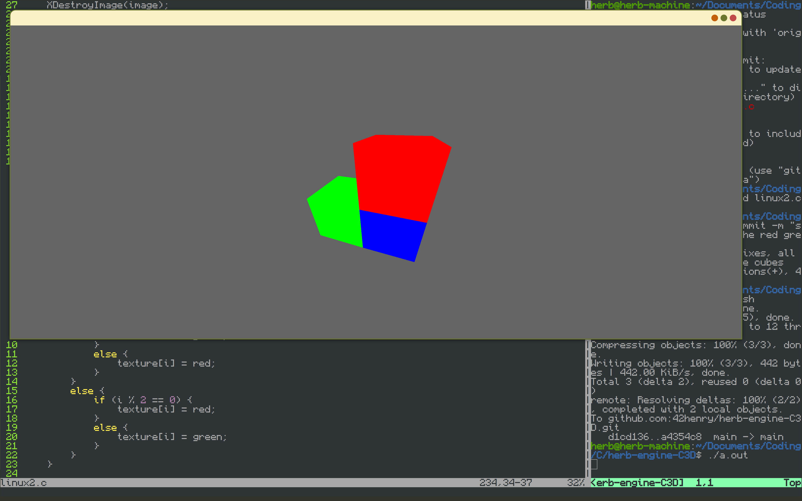
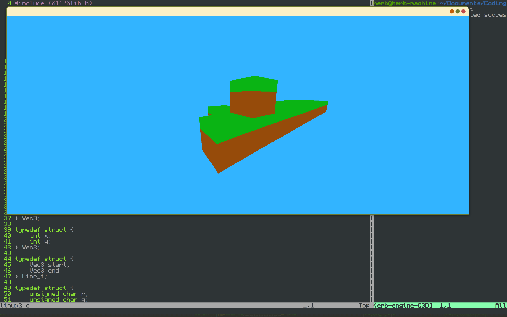
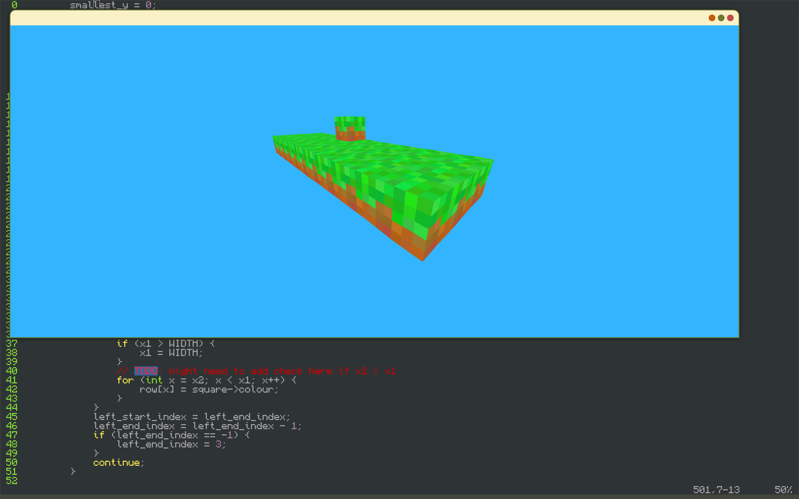
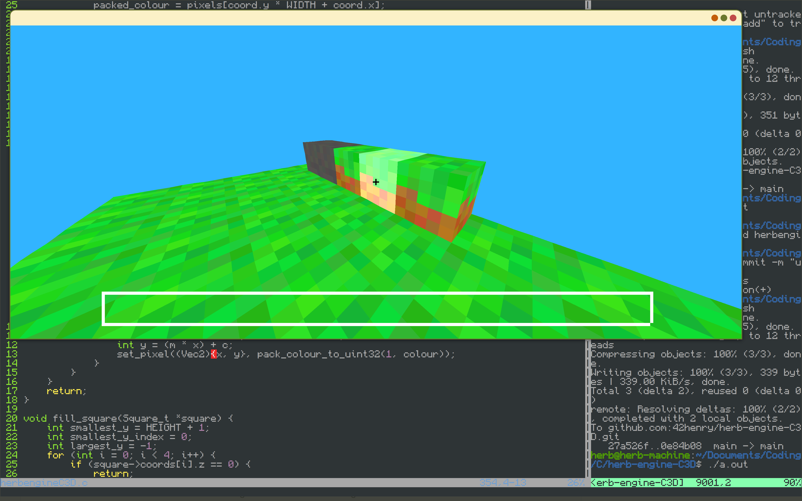

# herb-engine-C3D

Playground for 3D rendering from scratch
I know nothing about graphics, all I want is an array of pixels,
that I can update each frame with my own functions,
this is my attempt to make a 3D game like minecraft!
I have used gpt to help write the x11 or winapi parts of the code,
so I can just have my array of pixels that I update each frame.

Interesting to note - so far whatever I've done has recreated the style of PS1 graphics, whereby the vertices wobble slightly!

Some dev screenshots:

Work done so far:
 - a fill function that takes 4 points and a colour, and fills the screen with that colour
 - a rotate and project function that takes an x y and z and rotates it about the camera, and projects it by z
 - a texture map, which takes each square, and colours it pixel by pixel from a given texture
 - sort each square by their distance to the camera
 - simple cubicy collisions

Next steps:
 - velocity based movement
 - terrain generation - not sure how to do this yet
 - hotbar / other blocks we can build with
 - chunks?
 - make it platform generic

Future ideas:
 - I have no idea how to not draw something that is behind something else...

linux:
gcc -o main.o -lX11 -lm -O3 -march=native ./linux2.c
windows (behind schedule):
compile with gcc -o main.exe -lgdi32 -mwindows -g .\main-windows.c
